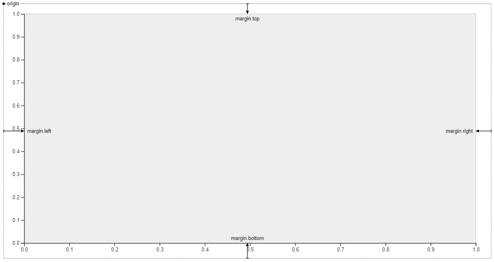
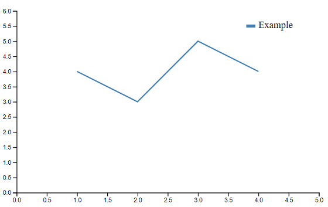

# Getting Started with D3.js V5
[D3.js API Reference](https://github.com/d3/d3/blob/master/API.md)

Before diving right into d3 there are a few things worth knowing which will make your life easier, this is by no means a replacement for a proper training on HTML / CSS however I want to mention some points which are essential to working with d3.

# Required files
- Although not necessary I find it useful to use a separate file for html and javascript.
- Below is a basic template to get started with
## HTML
- The D3 library is loaded here
- We have a div where we will insert the chart with ID #chart
```html
<!DOCTYPE html>
<html lang="en">
<head>
    <meta charset="UTF-8">
    <meta name="viewport" content="width=device-width, initial-scale=1.0">
    <title>Example!</title>
</head>
<body>
    <!-- Chart is inserted here -->
    <div id="chart"></div>
    <!-- javascript -->
    <script src="https://d3js.org/d3.v5.min.js"></script>
    <script src="main.js"></script>
</body>
</html>
```
## Javascript
For me I have found the easiest way to get started is to layout your javascript file with comments before you write any code. Having a comment for each section which will be required. This lets you think about the visualization at a high level before getting into the details. The example below does not take into account dynamic updates and where / how to place those.

- [Arrow functions](https://www.w3schools.com/js/js_function_definition.asp)
    - Within the d3 community arrow functions seem pretty rare, however, I think they look a lot cleaner and use them when I can.
```javascript
/* Create Margins ******************************************************************/

/* Create SVG and insert it ********************************************************/

/* Load in and process the data ****************************************************/

/* Create the Scales ***************************************************************/

/* Create the Axes *****************************************************************/

/* Create lines/bars/dots dependent on chart type **********************************/

/* Legend **************************************************************************/
```
# HTML/CSS element ID & Class
## Element ID
- Each html element can have a unique identifier and can be used with d3 to select and work with specific elements.
- When selecting an element by ID the # symbol is used.
```html
<div id="chart"></div>
```
```javascript
// Select the div with ID == chart
d3.select("#chart")
    // Once is it selected we can now add things here
    .append()
```
## Element Class
- Each element can belong to a class, this is useful when we want to select a group of elements and update them all at the same time.
- When selecting an element by class . is used.
- We can use d3 to set an elements style as well as attributes.
```html
<p class="warning">Warning!</p>
<p class="warning">Attention!</p>
<p class="warning">Stop!</p>
```
```javascript
// Select all warning paragraphs and change the color to red
d3.selectAll(".warning")
    .style("color", "red")
```

# Margins
D3 has a standard margin convention which is widely used. Getting to know this will make laying out visualizations much easier. The code below is what would be used for a SVG 600px wide and 400px tall and a margin of 50px on all sides.
```javascript
var margin = {top: 50, right: 50, bottom: 50, left: 50}
var width = 600 - margin.left - margin.right
var height = 400 - margin.top - margin.bottom
```


# SVG creation and insertion
Now we need to actually create the SVG and insert it into the html page. The code below selects the element with the ID *chart* and inserts the SVG in that position. We are setting the attributes of the svg with the **.attr()** method and using the sizing defined with our margins. We are also appending a group **.append("g")** to the svg which is being shifted by the value of the margins.
```javascript
var svg = d3.select("#chart")
            .append("svg")
            .attr("width", width + margin.left + margin.right)
            .attr("height", height + margin.top + margin.bottom)
            .append("g")
            .attr("transform", "translate(" + margin.left + "," + margin.top + ")")
```
# Data
## Define data manually
Sometimes it is useful to manually create a simple dataset, build the visualization and then insert more complex data. This way you can see any errors that may be introduced from your data.
```javascript
// An array of dictionaries, each dictionary is equivalent to one row of a typical csv file with the column names x, y.
data = [{x:1, y:4}, {x:2, y:3}, {x:3, y:5}, {x:4, y:4}]
```
## Load in a single data file
[Loading CSV files with D3](https://github.com/d3/d3-fetch/blob/v1.1.2/README.md#csv)

Data us by default loaded in as a string the =+ is used to convert to an integer.

**NOTE: if the visualization is static the remainder of the code will be placed within the .then() function where the comments indicate**

```javascript
d3.csv("mydatafile.csv").then(data => {
    
    data.forEach(d=>{
        d.year =+ d.year //convert to number
        d.no =+ d.no * 100 // convert to number and * 100
    })

    console.log(data)

    /* Create the Scales ***************************************************************/

    /* Create the Axes *****************************************************************/

    /* Create lines/bars/dots dependent on chart type **********************************/

    /* Legend **************************************************************************/

})
```
## Load in multiple data files
If multiple data files need to be loaded it can be done like this
```javascript
Promise.all([d3.csv("data0.csv"), d3.csv("data1.csv")]).then(data => {

    data[0].forEach(d=>{/* process datafile0 */})
    
    data[1].forEach(d=>{/* process datafile1 */})

})
```
## Filtering data
To filter data on a condition you can use _.filter()_ This is helpful when introducing buttons or menus to make the data interactive.
```javascript
data.filter(d => d.column_name == "some value")
```
# Scales
[D3 Scales API reference](https://github.com/d3/d3/blob/master/API.md#scales-d3-scale)

There are many types of d3 scales, these are used to "scale" the data from whatever units you are using to something that will fit within your SVG element and keep the correct proportions. Scales have two required attributes _range_ and _domain_.

- Range is the output size eg: [0, height] or [0, width] where height and width have been set earlier during the margin creation
- Domain is the range of your data eg: [0, 1] or [1990, 2020]

Some common scales
```javascript
var y = d3.scaleLinear() // eg for continuous numeric data
var x = d3.scaleOrdinal() // eg for categorical data
```
# Axes
[D3 Axes API reference](https://github.com/d3/d3-axis/blob/v1.0.12/README.md)

Axis generators are used to create axes based on scales. Depending on the position of the axis on the screen you will want to use different generators.
### Example line chart axes
```javascript
/* Create the Scales **************************************************************/
var x = d3.scaleLinear()
            .range([0,width])
            .domain([0,5])

var y = d3.scaleLinear()
            .range([height, 0])
            .domain([0, 6])

/* Create the Axes ***************************************************************/
// Generators
xAxisGenerator = d3.axisBottom(x)
xAxisGenerarot = d3.axisLeft(y)

// Append them to the SVG
svg.append("g")
    .call(x)
    // Move the axis to the bottom of the SVG
    .attr("transform", "translate(0," + height + ")") 

svg.append("g")
    .call(y)
```
# Adding data elements (lines/bars/dots)

## Full Example - Line Chart

```javascript
/* Create Margins *******************************************************************/
var margin = {top: 50, right: 50, bottom: 50, left: 50}
var width = 600 - margin.left - margin.right
var height = 400 - margin.top - margin.bottom

/* Create SVG and insert it *********************************************************/
var svg = d3.select("#chart")
            .append("svg")
            .attr("width", width + margin.left + margin.right)
            .attr("height", height + margin.top + margin.bottom)
            .append("g")
            .attr("transform", "translate(" + margin.left + "," + margin.top + ")")

/* Load in and process the data ****************************************************/
data = [{x:1, y:4}, {x:2, y:3}, {x:3, y:5}, {x:4, y:4}]
console.log(data)

/* Create the Scales ***************************************************************/
var x = d3.scaleLinear()
            .range([0,width])
            .domain([0,5])

var y = d3.scaleLinear()
            .range([height, 0])
            .domain([0, 6])

/* Create the Axes *****************************************************************/
xAxisGenerator = d3.axisBottom(x)
yAxisGenerator = d3.axisLeft(y)

svg.append("g")
    .call(xAxisGenerator)
    .attr("transform", "translate(0," + height + ")") 

svg.append("g")
    .call(yAxisGenerator)

/* Create lines/bars/dots dependent on chart type **********************************/
// Line Generator
var line = d3.line()
    .x(d=>{return x(d.x)})
    .y(d=>{return y(d.y)})

// Create the line
svg.append("path")
    .attr("d", line(data))
    .attr("stroke", "steelblue")
    .attr("stroke-width", "2")
    .attr("fill", "none")

/* Legend **************************************************************************/
svg.append("text")
    .attr("x", width - 100)
    .attr("y", 25)
    .attr("text-anchor", "start") // horizontal positioning
    .attr("alignment-baseline","middle") // vertical positioning
    .text("Example")

svg.append("line")
    .attr("x1", width - 120)
    .attr("x2", width - 105)
    .attr("y1", 25)
    .attr("y2", 25)
    .attr("stroke", "steelblue")
    .attr("stroke-width", "5")
```
### Example output



## Data Joins
In the above example, we have used the _.append()_ method to add our path to the SVG. But what if we want to be able to update the data and have the chart change also? This is where _.join()_ comes in. For a detailed look at this see [here](https://observablehq.com/@d3/selection-join) however I will update the above example to use the _.join()_. To add transitions and custom effects when data changes, is added or removed see the link above.
```javascript
// Add the initial path on page load
svg.append("path")
    .attr("d", line(data))
    .attr("class", "chart-line") // add a class to the line so we can reselect for the join
    .attr("stroke", "steelblue")
    .attr("stroke-width", "2")
    .attr("fill", "none")

// Select all elements with the class "chart-line" and update them according to the new data
svg.selectAll(".chart-line")
    .join("path")
        .attr("d", line(data))
        .attr("stroke", "steelblue")
        .attr("stroke-width", "2")
        .attr("fill", "none")
```


# Interactivity 
Adding interactivity to charts adds some complexity to the code, some things to consider when doing this
- When will the chart change? On a timer? On a button click?
- What HTML elements do I need to add
- Where to place [event listeners](https://github.com/d3/d3-selection/blob/v1.4.1/README.md#handling-events)
- What needs to be updated - data? scale domains? etc.
- Transition effects
- Code structure for update functions

## Basic file structure with interactivity
This will be different from a static visualization, here is an example which can be modified as required. This example is loading data from a file, notice the location of the update function and event listener.
```javascript
/* Create Margins ******************************************************************/
var margin = {top: 50, right: 50, bottom: 50, left: 50}
var width = 600 - margin.left - margin.right
var height = 400 - margin.top - margin.bottom

/* Create SVG and insert it ********************************************************/

var svg = d3.select("#chart")
            .append("svg")
            .attr("width", width + margin.left + margin.right)
            .attr("height", height + margin.top + margin.bottom)
            .append("g")
            .attr("transform", "translate(" + margin.left + "," + margin.top + ")")

/* Load in and process the data ****************************************************/
d3.csv("mydatafile.csv").then(data => {
    
    data.forEach(d=>{
        d.year =+ d.year //convert to number
        d.no =+ d.no * 100 // convert to number and * 100
    })

    console.log(data)

    // Create the Scales

    // Create the Axes 

    // Create the initial lines/bars/dots dependent on chart type

    // Legend
    
    // Create an event listener / timer which calls the update function

})

/* Create an update function ********************************************************/

function update(data){
    // Update the scales domains if required
    // Update chart with a join
}
```

# Handy Code Snippets
## Text
```javascript
svg.append("text")
    .attr("x", width / 2) // in the middle
    .attr("y", 100)
    .attr("text-anchor", "middle") // horizontal position
    .attr("dominant-baseline", "middle") // vertical position
    .text("hi")
```
## Circle
```javascript
svg.append("circle")
    .attr("cx", 200) 
    .attr("cy", 200) 
    .attr("r", 100)
    .attr("fill", "green")
```
## Rectangle
```javascript
svg.append("rect")
    .attr("x", 0)
    .attr("y", 0)
    .attr("width", 30)
    .attr("height", 50)
    .attr("fill", "blue")
```
## Line
```javascript
svg.append("line")
    .attr("x1", 30)
    .attr("y1", 0)
    .attr("x2", 200)
    .attr("y2", 200)
    .attr("stroke", "black") // Stroke is required for visibility
    .attr("stroke-width", 5)
```
## Tick formatting
```javascript
d3.axisBottom(x)
    .tickSize()
    .tickSizeOuter()
    .tickSizeInner()
    .ticks(10) // number of ticks
    .tickFormat() // d3.format()
    .tickValues([1, 2, 3, 4]) // manually set values
```
## Rotation
```javascript
// Can be used after the .call() of an axis to rotate tick labels, or any other objects as selected
d3.selectAll("text")
    .attr("y", "10")
    .attr("x", "-5")
    .attr("text-anchor", "end")
    .attr("transform", "rotate(-40)")
```

# Notes
- When creating multiple visualizations on a single page be very specific with variable naming, things can get out of hand quickly.
- When looking for example code always make sure it is the same version of d3
- https://bl.ocks.org/ is a good place to look for examples
- https://observablehq.com does not use standard javascript, it can be good for snippets but beware.


